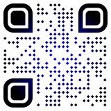
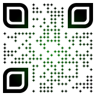
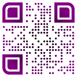
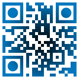
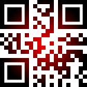
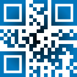

# qr-mon
Microservice to create qr data stream in NodeJS with customized design options.

##
<p float="left">
 &nbsp; &nbsp;
 &nbsp; &nbsp;
 &nbsp; &nbsp;
 &nbsp; &nbsp;
</p>

### Getting Started
```
npm install qr-mon --save
```
```
var express = require('express');
var app = express();

var qr-mon = require('qr-mon');

app.get('/qr', function(req, res) {
    let error = false;
    let options = req.query;
    let text = req.query.data ? req.query.data : error = true;
    if (!error) {
        var code = qr-mon.generate(text, options);
        res.type('svg');
        res.send(code);
    } else {
        res.status(500);
        res.json({ error: 'Needs text to be encoded' });
    }
});

app.listen(3000, () => console.log('server started.....'));
```

### HTML
```

```


## Options

### **margin**
_Margin to be left around the qr code_  
>Type: Integer  
Default : 0

### **background**
_Background color the qr code_  
>Type: rgb()  
Default : transparent

### **shape**
_Shape of points inside the body of the qr code_  
>Default : 0, square

Option | Image
--- | ---
0 | 
1 | 
2 | 
3 | 

### **eye ball**
_Shape of inner section of the position markers_  
>Default : 0, square

Option | Image
--- | ---
0 | 
1 | 
2 | 
3 | 
4 | 
5 | 
6 | 
7 | 
8 | 
rotary | 

### **eye frame**
_Shape of frame of the position markers_  
>Default : 0, square

Option | Image
--- | ---
0 | 
1 | 
2 | 
3 | 
4 | 
5 | 
6 | 
7 | 
8 | 

### **fill**
_Fill of the qr code_  
>Default : solid

+ solid
+ linear-horizontal
+ linear-vertical
+ radial

### **color**
_color of the qr code_  
>Default :  
solid : black  
gradient : rgb(0,0,0), rgb(2,119,189)

+ solid - rgb / name of color
+ gradient - color1.color2 

<p float="center">

&nbsp;

</p>

```
1. http://localhost:3000/qr?data=my_data&fill=radial&color=red.black

2. http://localhost:3000/qr?data=my_data&fill=radial  (default-fill)
```